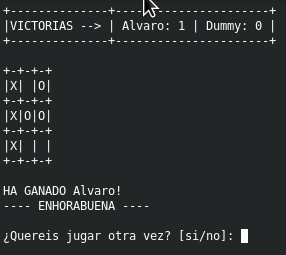

# Connect 3
> Another ASCII Tic-tac-toe.

[](https://www.python.org/)

Another Tic-tac-toe in ASCII and Python that I made once I was bored. And to top it off with code in Spanish


## Installation

Just clone the repo:

```sh
$ git clone https://github.com/Alburrito/connect3.git
```

Then go to connect3/connect3 directory and execute:

```sh
$ python3 connect3.py
```


## Usage example

When the game starts, the title screen appears where you enter the names of the participants:


To select the box, coordinates are requested (from 1 to 3) counting from left to right and from top to bottom:


At the end of a game, the victory counter increases and you can choose to play a new game or end the game:




## Development setup

No dependencies are required. Just Python3.


## Meta

Álvaro Martín – [@Alburrito](https://github.com/Alburrito) – almarlop98@gmail.com

Distributed under the GNU GPL license. See ``LICENSE`` for more information.

## Contributing

1. Fork it (<https://github.com/Alburrito/connect3/fork>)
2. Create your feature branch (`git checkout -b feature/fooBar`)
3. Commit your changes (`git commit -am 'Add some fooBar'`)
4. Push to the branch (`git push origin feature/fooBar`)
5. Create a new Pull Request